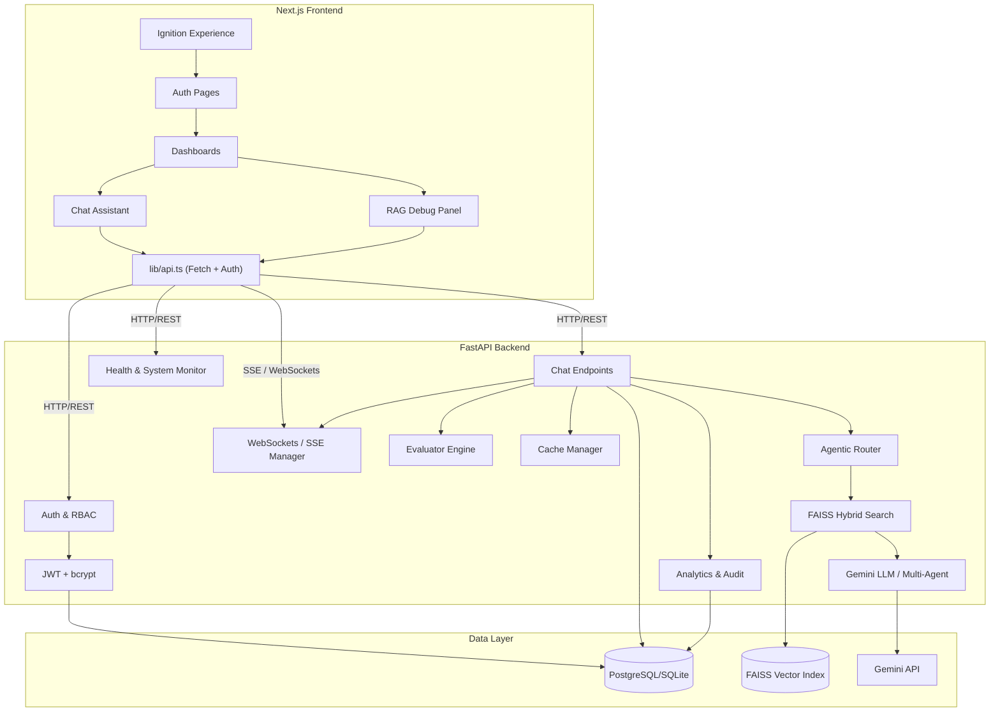
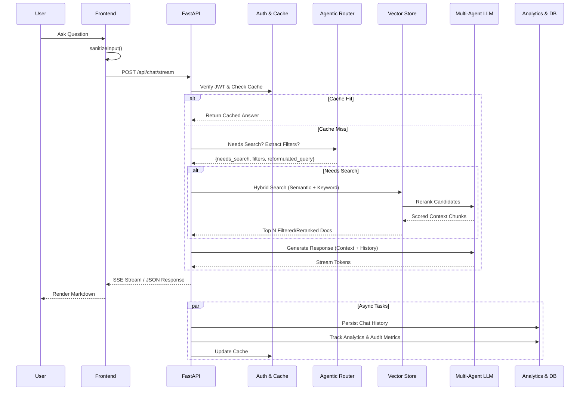

# 🏎️ Pagani Zonda R – Enterprise Intelligence

> A full-stack AI-powered enterprise system featuring RAG (Retrieval-Augmented Generation), role-based access control, and a cinematic car showcase experience.

[](https://nextjs.org/)
[](https://fastapi.tiangolo.com/)
[](https://ai.google.dev/)
[](LICENSE)

---

## ✨ Features

| Feature | Description |
|---------|-------------|
| 🤖 **Multi-Modal RAG** | AI assistant with PyMuPDF image extraction, semantic chunking, dynamic metadata filtering, and LLM-Reranking (Cross-Encoder) |
| 🧠 **Multi-Agent Orchestration** | Advanced agentic execution with specialized sub-agents breaking down complex queries |
| 🔐 **JWT Authentication** | Secure login with access/refresh token rotation and role-based access (Admin, Engineer, Viewer) |
| 🎬 **Cinematic Ignition** | Video-based intro experience with Framer Motion animations |
| 📊 **Admin Dashboard** | Executive-style dashboard with system metrics and AI query interface |
| 🔧 **Engineer Dashboard** | Technical console with engineering-focused data access |
| 🛡️ **Live RAG Debug** | Real-time AI pipeline trace (pipeline steps, vector search results, retrieved chunks, and latencies) |
| 🎯 **Role-Based Data** | Documents filtered by user role — admins see financials, engineers see technical specs |
| 💾 **Database Persistence** | SQLAlchemy ORM with PostgreSQL/SQLite for users, chat history, system logs, and analytics |
| 🛡️ **Security Hardening** | Security headers, rate limiting, request size limits, input sanitization, CORS |
| 📝 **Structured Logging & Audit** | Rotating file logs + DB persistence for all system events, and full security auditing |
| 📈 **Analytics & Evaluation** | Non-invasive usage analytics for chat, login, system events, and built-in Evaluator Engine for IR metrics |
| 🚀 **WebSockets/SSE** | Real-time streaming and bidirectional communication for pipeline state and chat responses |
| 🐳 **Docker Ready** | docker-compose with frontend, backend, and PostgreSQL services |

---

## 🏗️ Architecture



---

## 🔄 System Workflow



---

## 🚀 Quick Start

### Prerequisites
- Node.js 18+, Python 3.11+, Git

### Setup

```bash
# Clone
git clone https://github.com/Nischal-S143/EnterpriseRAG.git
cd EnterpriseRAG

# Frontend
npm install

# Backend
cd backend
pip install -r requirements.txt
# Configure backend/.env (see .env.example)
```

### Run

```bash
# Terminal 1: Backend
cd backend && python main.py

# Terminal 2: Frontend
npm run dev
```

Open [http://localhost:3000](http://localhost:3000)

> See [docs/Setup.md](docs/Setup.md) for detailed setup instructions including Docker.

### Live RAG Debug Trace
To view the live vector search and RAG tracing dashboard, navigate to:
[http://localhost:3000/rag-debug](http://localhost:3000/rag-debug)

---

## 🧪 Testing

```bash
# Backend tests
cd backend && python -m pytest tests/ -v

# Frontend tests (when configured)
npm test
```

---

## 📁 Project Structure

```
├── app/                    # Next.js pages
│   ├── dashboard/          # Admin & Engineer dashboards
│   ├── login/              # Login page
│   ├── register/           # Registration page
│   └── page.tsx            # Home (Ignition + Scroll experience)
├── components/             # React components
│   ├── ChatAssistant.tsx   # AI chat with streaming + markdown
│   ├── IgnitionExperience.tsx
│   ├── Navbar.tsx
│   └── Zonda*.tsx          # Scroll animation components
├── lib/                    # Frontend utilities
│   ├── api.ts              # API client + input sanitization
│   ├── auth.ts             # Auth functions
│   └── logger.ts           # Debug logger
├── backend/                # FastAPI backend
│   ├── main.py             # API endpoints + middleware
│   ├── auth.py             # JWT auth + user management
│   ├── rag_pipeline.py     # RAG with Gemini + memory
│   ├── vector_store.py     # FAISS + hybrid search + LLM Reranking
│   ├── pdf_ingester.py     # Multi-Modal PyMuPDF ingestion & Vision Parsing
│   ├── database.py         # SQLAlchemy config
│   ├── models.py           # DB models
│   ├── middleware.py        # Security middleware
│   ├── logging_config.py   # Structured logging
│   └── tests/              # pytest test suite
├── docs/                   # Documentation
│   ├── Architecture.md
│   ├── Setup.md
│   └── API.md
├── docker-compose.yml      # Docker multi-service config
└── .env.example            # Environment template
```

---

## 📚 Documentation

- [Architecture](docs/Architecture.md) – System design, data flow, component overview
- [Setup Guide](docs/Setup.md) – Local setup, Docker, environment variables
- [API Reference](docs/API.md) – All endpoint documentation

---

## 🤝 Contributing

See [CONTRIBUTING.md](CONTRIBUTING.md) for guidelines.

## 🔒 Security

See [SECURITY.md](SECURITY.md) for our security policy and reporting vulnerabilities.

## 📜 Code of Conduct

See [CODE_OF_CONDUCT.md](CODE_OF_CONDUCT.md).
