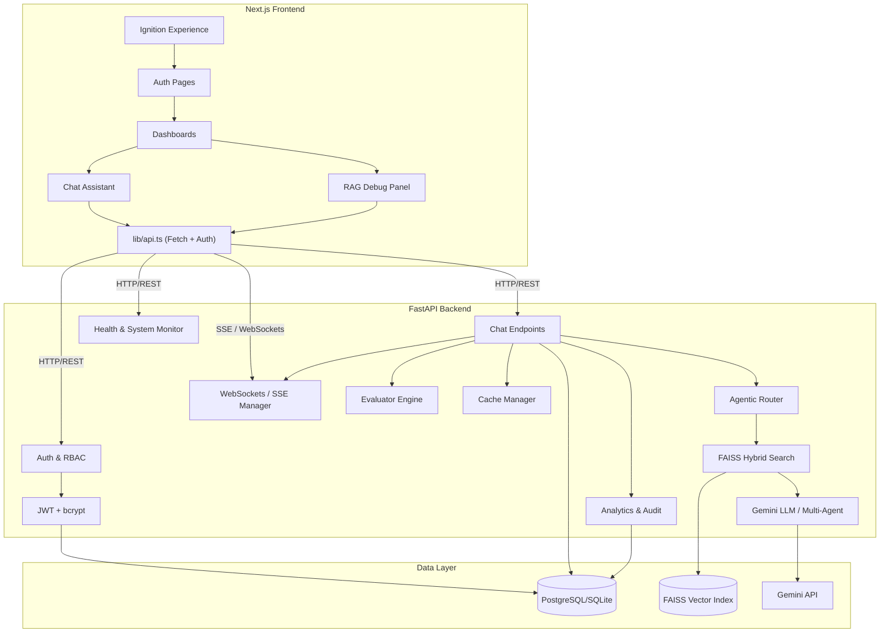
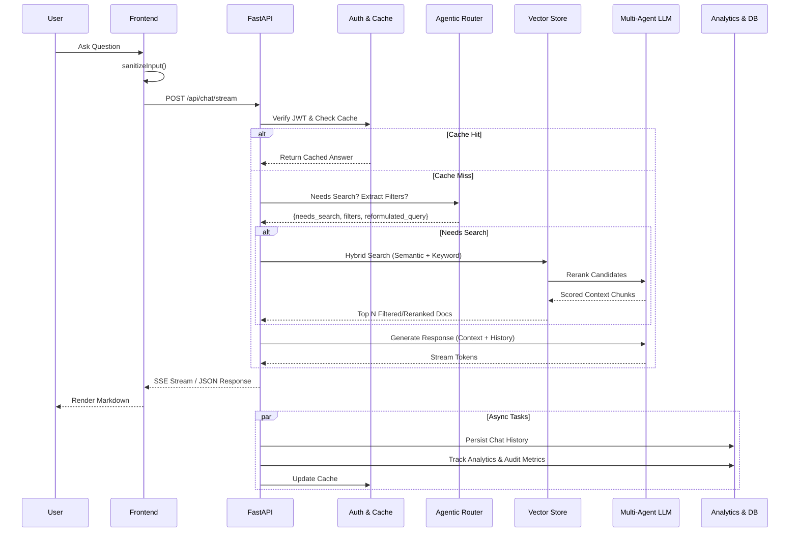

# Architecture

## System Overview

The Pagani Zonda R Enterprise Intelligence system is a full-stack AI application with role-based access control and RAG-powered chat, augmented with multi-agent orchestration, analytics, and real-time streaming capabilities.

## Frontend

- **Framework**: Next.js 16 with React 19 and TypeScript
- **Styling**: TailwindCSS 4 with custom Pagani design tokens
- **Animation**: Framer Motion for page transitions and UI interactions
- **State**: React hooks (useState, useEffect, useCallback)
- **Auth**: JWT tokens stored in localStorage with auto-refresh

### Key Components

| Component | Purpose |
|-----------|---------|
| `IgnitionExperience` | Cinematic intro with video playback |
| `Navbar` | Navigation with auth state, role display |
| `ChatAssistant` | RAG-powered AI chat with streaming |
| `RAGDebugPanel` | Live AI processing trace component (pipeline steps, results, latencies) |
| `ZondaScrollCanvas` | Scroll-driven image sequence animation |
| `ZondaExperience` | HUD overlay for scroll experience |

## Backend

- **Framework**: FastAPI with Pydantic validation
- **Auth**: JWT (access + refresh tokens) via python-jose
- **Database**: SQLAlchemy ORM (PostgreSQL/SQLite)
- **Vector Store**: FAISS with Gemini embeddings
- **LLM**: Google Gemini API
- **Rate Limiting**: slowapi
- **Security**: Custom middleware (headers, request size limits)

### Key Backend Components

- **`multi_agent.py`**: Orchestrates advanced multi-agent interactions, where complex user queries are broken down and handled by specialized sub-agents.
- **`evaluator.py`**: Built-in engine for analyzing Information Retrieval (IR) metrics, calculating RAG pipeline efficiency, accuracy, and providing continuous evaluation.
- **`analytics.py` & `audit.py`**: Comprehensive usage tracking, security auditing, login monitoring, and performance telemetry recording.
- **`websocket_manager.py` & `sse_manager.py`**: Manages real-time bidirectional communication and Server-Sent Events (SSE) for streaming AI responses and live pipeline state updates.
- **`cache.py`**: Query caching mechanism to improve response times for frequently asked questions, significantly reducing latency and LLM API costs.

### RAG Pipeline

1. **Multi-Modal Ingestion**: PDFs are parsed using PyMuPDF and Gemini Vision (`gemini-1.5-pro`) to extract complex diagrams and tables alongside text. Semantic chunking (`MarkdownTextSplitter`) preserves document structure.
2. **Agentic Router**: Decides if vector search is needed; reformulates queries using chat history and extracts contextual metadata filters constraint tags.
3. **Hybrid Search**: FAISS semantic search + keyword search with Reciprocal Rank Fusion, followed by metadata and role-based filtering.
4. **LLM Reranking (Cross-Encoder)**: A secondary LLM pass (`gemini-2.5-flash`) scores and reranks the broader FAISS retrieval from 0-100 to extract the most highly relevant context.
5. **Response Generation**: Gemini generates response with context + system prompt.

### Authentication Flow

1. User registers → password hashed with bcrypt → stored in memory + DB
2. User logs in → JWT access token (30min) + refresh token (7 days) issued
3. API requests include Bearer token → verified via `get_current_user` dependency
4. On 401 → frontend auto-refreshes token and retries

## Data Flow

